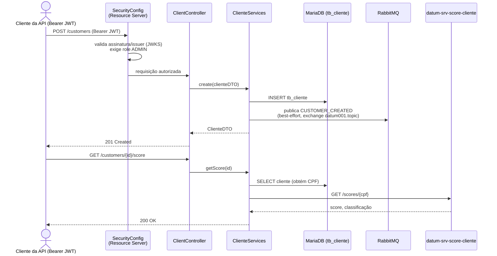
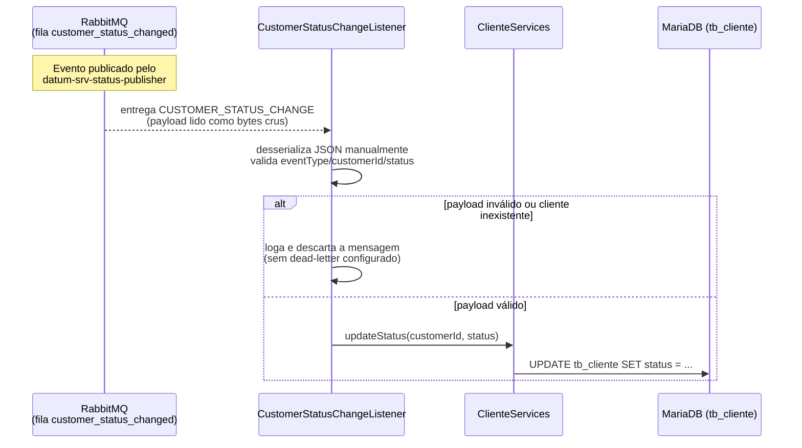
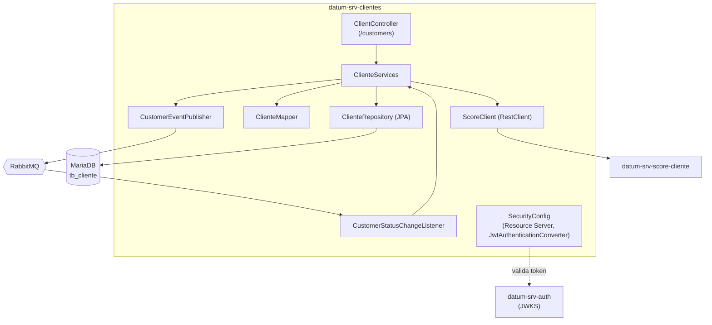

# datum-srv-clientes

API REST principal da stack **Datum**: gestão de clientes (CRUD), consulta de score e orquestração dos eventos assíncronos da solução.

## Função do serviço

O `datum-srv-clientes` expõe os endpoints REST de gestão de clientes e concentra a maior parte da lógica de negócio da stack:

- **CRUD de clientes** (`/customers`): criação, consulta (por id, listagem, busca por nome e/ou status), alteração e exclusão, persistidos na tabela `tb_cliente` (MariaDB).
- **Consulta de score** (`GET /customers/{id}/score`): busca o CPF do cliente localmente e consulta o serviço externo `datum-srv-score-cliente` via REST síncrono, retornando score e classificação.
- **Publicação de eventos**: ao criar um cliente com sucesso, publica de forma *best-effort* o evento `CUSTOMER_CREATED` no RabbitMQ (a criação já foi persistida antes — falha na publicação é apenas logada, não desfaz a criação).
- **Consumo de eventos**: escuta a fila `customer_status_changed` e aplica a alteração de status solicitada por outro serviço (`datum-srv-status-publisher`), sem exigir chamada HTTP direta.
- **Validação de autorização**: como *OAuth2 Resource Server*, valida o Access Token JWT emitido pelo `datum-srv-auth` e aplica a regra de papéis — `USER` só consulta (GET), `ADMIN` também cria/altera/exclui.

## Tecnologias

| Categoria | Tecnologia |
|---|---|
| Linguagem / runtime | Java 21 |
| Framework | Spring Boot 3.5.16 |
| Web | Spring Web (REST), Bean Validation (`spring-boot-starter-validation`) |
| Segurança | Spring Security, OAuth2 Resource Server (validação de JWT via JWKS) |
| Persistência | Spring Data JPA / Hibernate, `Specification` (JPA Criteria) para busca dinâmica |
| Mensageria | Spring AMQP (RabbitMQ) — publisher e listener |
| Cliente HTTP | `RestClient` (Spring 6), com timeouts de conexão/leitura configurados |
| Observabilidade | Spring Boot Actuator |
| Banco de dados | MariaDB (driver `mariadb-java-client`) |
| Build | Maven (via `mvnw`) |
| Empacotamento / execução | Docker (build multi-stage `eclipse-temurin:21-jdk`) |
| Testes | Spring Boot Test, Spring Security Test |

## Dependências (serviços necessários para funcionar)

| Dependência | Uso | Obrigatório |
|---|---|---|
| **MariaDB** | Armazena a tabela `tb_cliente` (dados dos clientes). | Sim |
| **RabbitMQ** | Publica `CUSTOMER_CREATED` (exchange `datum001.topic`) e consome `CUSTOMER_STATUS_CHANGE` (fila `customer_status_changed`, declarada pela própria aplicação na subida). | Sim para consumir status; publicação de `CUSTOMER_CREATED` é *best-effort* (falha não derruba a aplicação nem a operação de criação). |
| **datum-srv-auth** | Emite e assina (RSA) os JWTs validados a cada requisição, via JWKS resolvido automaticamente a partir do `issuer-uri`. | Sim, para qualquer chamada autenticada |
| **datum-srv-score-cliente** | Chamado via REST síncrono em `GET /customers/{id}/score` (`ScoreClient`). | Somente para esse endpoint — os demais funcionam sem ele |

Variáveis de ambiente relevantes (ver `docker-compose.yml` na raiz do projeto): `DB_HOST`/`DB_PORT`/`DB_USERNAME`/`DB_PASSWORD`, `RMQ_HOST`/`RMQ_PORT`/`RMQ_USERNAME`/`RMQ_PASSWORD`, `AUTH_HOST`/`AUTH_PORT` (issuer do JWT) e `SCORE_SERVICE_HOST`/`SCORE_SERVICE_PORT`.

## Arquitetura

### Endpoints

| Método | Caminho | Papel exigido | Descrição |
|---|---|---|---|
| `GET` | `/customers` | `USER`/`ADMIN` | Lista todos, ou filtra por `status` |
| `GET` | `/customers/search?name=` | `USER`/`ADMIN` | Busca por nome (parcial, case-insensitive) |
| `GET` | `/customers/{id}` | `USER`/`ADMIN` | Busca por id |
| `GET` | `/customers/{id}/score` | `USER`/`ADMIN` | Consulta score via `datum-srv-score-cliente` |
| `POST` | `/customers` | `ADMIN` | Cria cliente + publica `CUSTOMER_CREATED` |
| `PUT` | `/customers/{id}` | `ADMIN` | Atualiza cliente (payload completo) |
| `DELETE` | `/customers/{id}` | `ADMIN` | Remove cliente |

### Fluxo — criação de cliente e consulta de score



### Fluxo — alteração de status via fila (assíncrono)



### Componentes internos



- **Validação de CPF**: anotação customizada `@CPF` (Bean Validation), aplicada em `ClienteDTO`.
- **Serialização de status**: `status` é `boolean` no domínio, mas serializado/desserializado como texto (`ACTIVE`/`INACTIVE` — ver `StatusSerializer`/`StatusDeserializer`/`StatusConverter`) na API e nos eventos.
- **Busca dinâmica**: `search`/`findAll` usam `Specification` (JPA Criteria) para combinar filtros por nome e status sem duplicar queries.
- **Publisher best-effort vs. consumidor estrito**: publicar `CUSTOMER_CREATED` nunca desfaz a criação já persistida; já o consumo de `CUSTOMER_STATUS_CHANGE` descarta silenciosamente mensagens inválidas (sem fila de erro configurada).

## Como subir

Este serviço faz parte da stack orquestrada pelo `docker-compose.yml` na raiz do repositório [`projeto-datum`](https://github.com/alexmart001/projeto-datum). Para subir apenas ele (com suas dependências):

```bash
docker compose up mariadb rabbitmq datum-srv-auth datum-srv-score-cliente datum-srv-clientes
```
